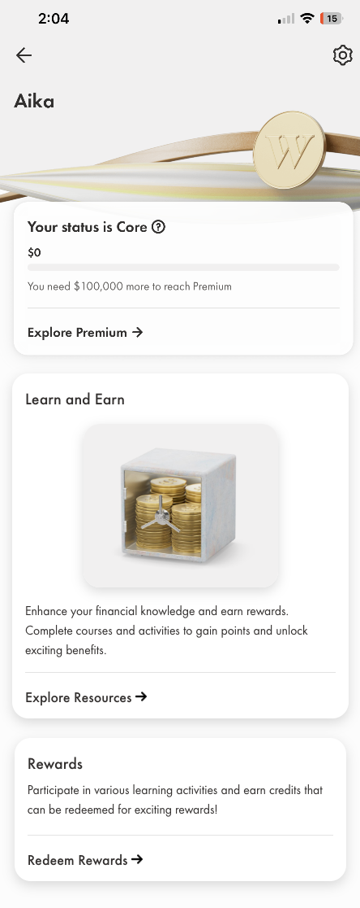
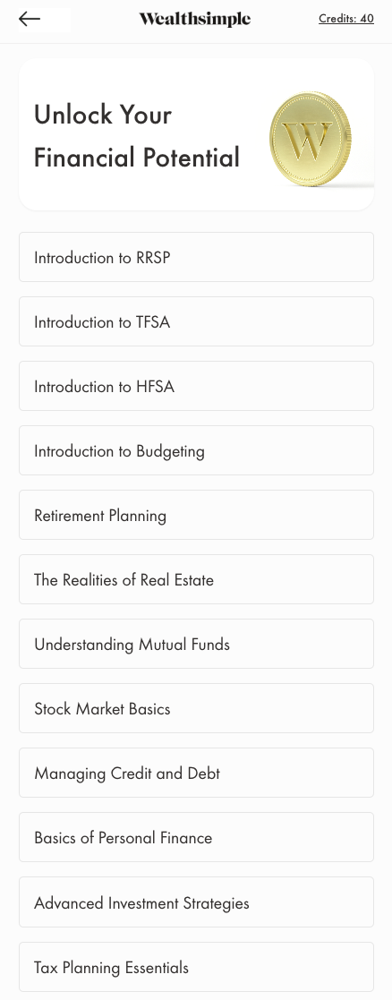
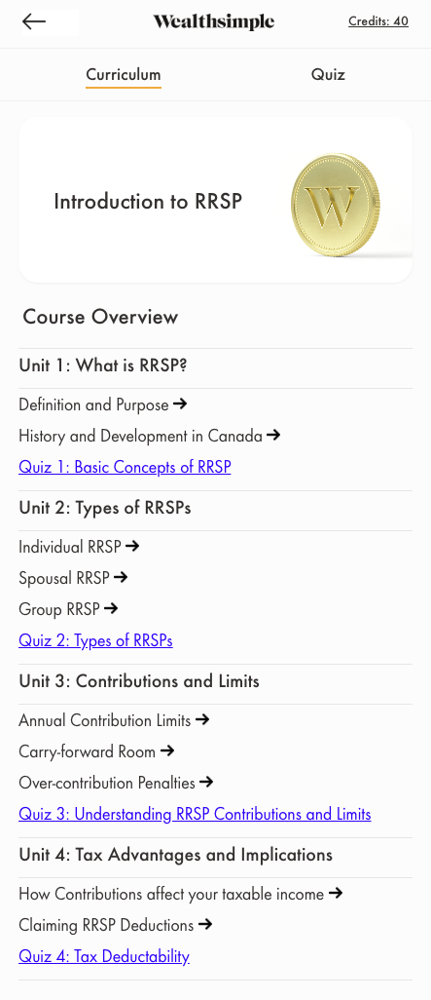
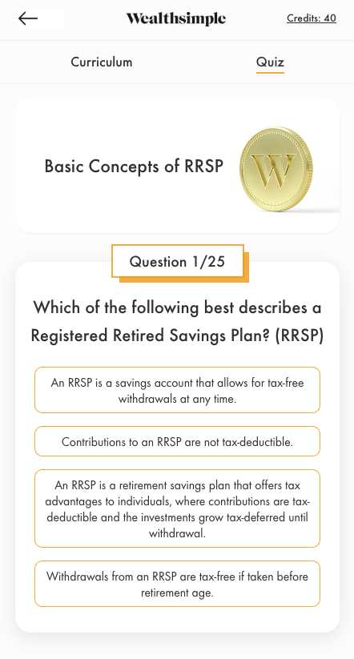
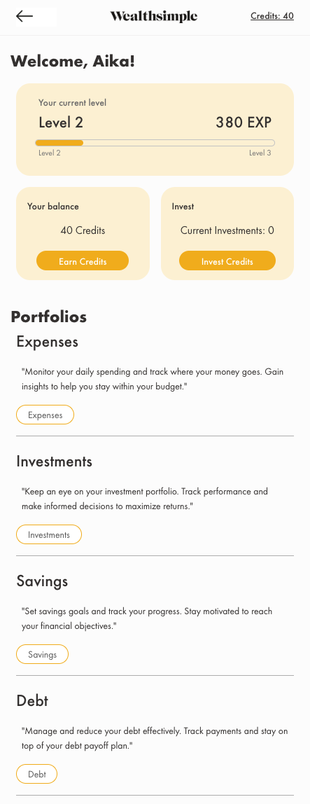

# Wealthsimple Industry Project

## Meet the Team
Presented by Cyber Squatters | Aika, Tina, Brittany and Megha

## Problem Space
How might we help Wealthsimple clients in Canada to improve their financial literacy and make better personal finance decisions?

## Our Solution
We propose a financial literacy enhancement feature within the Wealthsimple app. This feature offers users a series of financial literacy courses, quizzes, and rewards to improve their financial knowledge and decision-making skills.

Key Features:
- Educational Courses: Comprehensive courses covering topics like RRSP, TFSA, budgeting, and more. 
- Interactive Quizzes: Quizzes following each course to reinforce learning and track progress.
- Earn and Redeem Credits: Users earn credits for completing courses and quizzes. These credits can be redeemed for rewards, such as investment opportunities or access to premium Wealthsimple functionalities.

## Target Audience and Partnerships
While this feature is designed primarily for Wealthsimple clients, we propose extending its reach by partnering with universities, colleges, and other educational institutions. These partnerships could involve both the institutions themselves and student-led organizations. Given the current economic climate, young adults, including students and recent graduates, are among those most affected by financial challenges. By targeting this demographic, we aim to equip them with the necessary tools and knowledge to make informed financial decisions.

Not only will this initiative help students learn more and be guided by this financial literacy program, but it will also assist Wealthsimple in becoming more established within the academic community. Creating connections and reaching out to students and educational institutions will increase Wealthsimple's visibility and user base. This strategy will help Wealthsimple build relationships with potential lifelong customers, thus enhancing its market presence and expanding its user base.

We hope that our solution integrates financial literacy courses into the Wealthsimple app, enabling users to learn, take quizzes, earn credits, and redeem rewards, thereby fostering better personal finance decisions. Additionally, through strategic partnerships with educational institutions, we can extend our impact to young adults who are most in need of financial education.

## App Notes
To checkout the app-demo: run `npm run dev` in your console.  
<i> Please make sure that the app view width is set to 445px in the responsive tab of Chrome Dev Tools.</i>

- The app was mainly based off the wealthsimple phone app. We decided to do a simple coded app rather than using figma to show basic functionality (but also mainly because we are a team of developers with little figma experience...)
    - With that being said, everything is hard-coded and we'd like to highlight that this app contains simple functionality and doesn't explore the depths of logic and back-end, but will be explained during the presentation.
- Everything is to be <b> viewed strictly in 445px (WIDTH) </b> as we based it off the app screenshot.
- The hard-coded functionality only shows one possible example of each functionality and scenario.

## App Screenshots
Dashboard:

Resources Page:

Curriculum Page:

Quiz Page:

Rewards Page:
